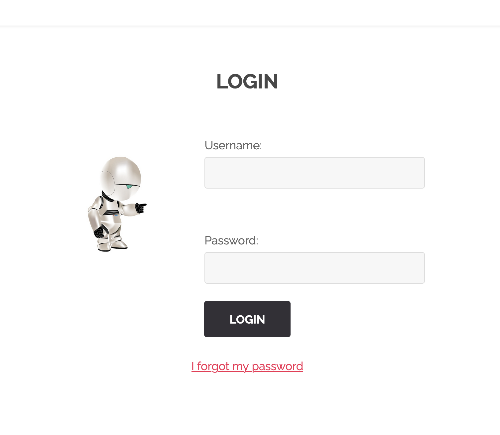

# Authentication Brute Forcing.

On the home page of the website we find a link to `sign in`

We tried default username and password like `admin`, `user`. But it didn't work.

So we used the most common passwords for the `admin` username. You will find the script we used in `./script`.

## How to protect ?
Use strong passwords with lower and upper case letters, special characters and also numbers. Make sure that the password is bigger than 8 characters in total.
You can also ban ip addresses that bruteforce your website using services like `iptables`.
