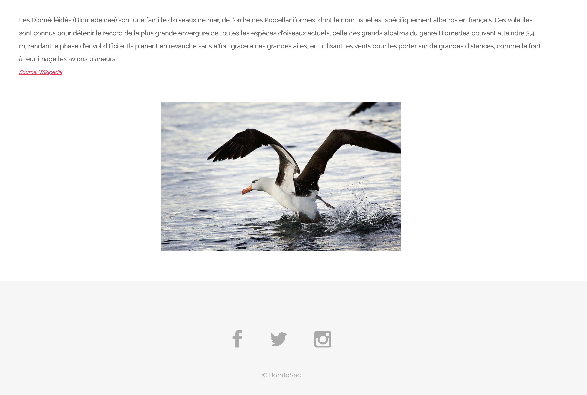
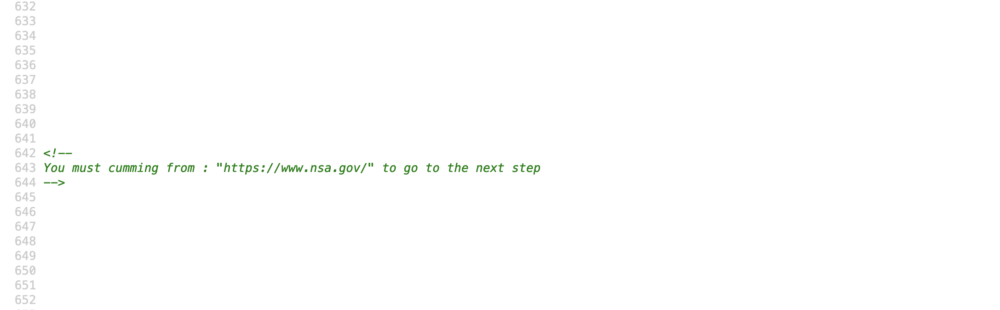
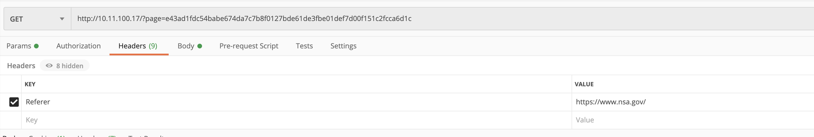
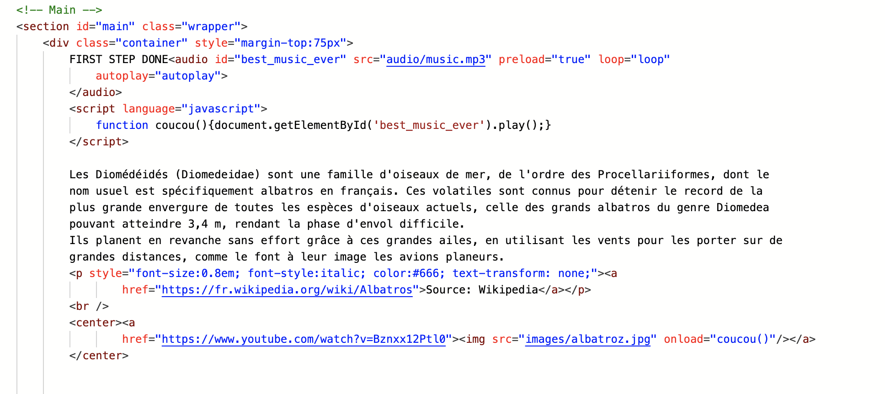
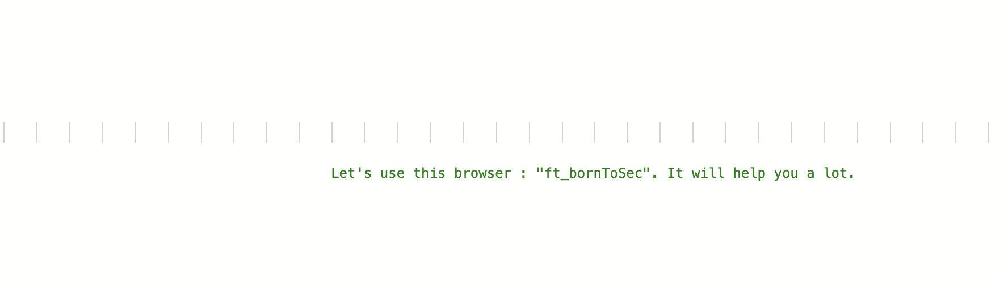
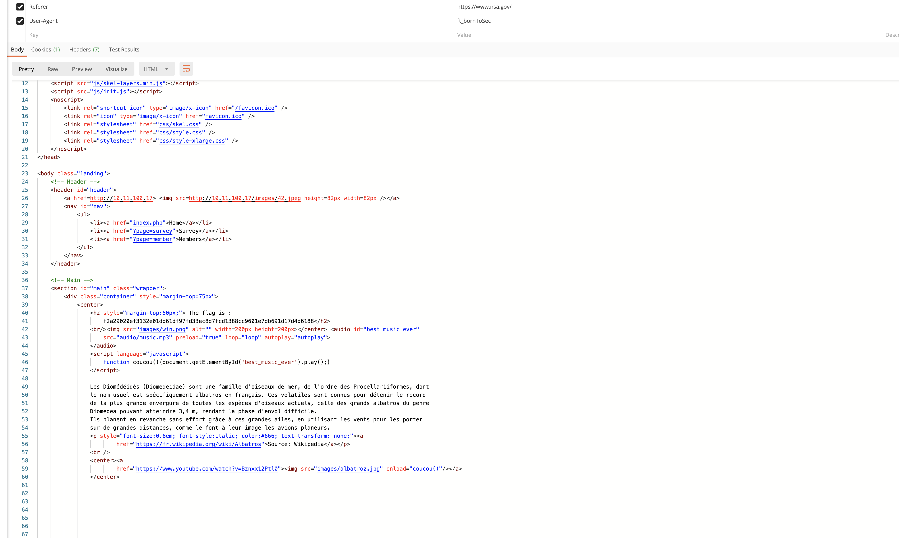

# Changing Headers

In this one, we go to the index page, and scroll down until we hit the end. We will see a `borntosec`, click on it.

Then we have a page that looks like this :

Now, let's open the source code, at first there's nothing, but we have some empty space below the source code. Keep scrolling and we will find some comments. Most of the comments are useless, but this one is interesting.

After searching for a bit, we find that we can change a `header` variable named `Refere`. Which is like a variable that tells the request where we coming from. In other words, it contains an address that makes the request.

We can use `postman` to make the request and here's how :

We added a new variable in the `header` tab that is named `Referer`, with the value of the website they wanted us to come from.
Let's send the request and see what we get :

As we can see, first step is done. Scrolling down, we will see that we need one more thing :

Again, searching a bit for something related with requests using different browser. We will find that there's a certain variable in `header` that is used to define what type of browser we're using. This variable is called `User-Agent`.
It's already set in `postman`. We couldn't change that variable so we disable it, and create another one with the same name, and the key given to us.

## How to protect ?
Don't leave dumb comments like this ? And no one would know about anything ?
