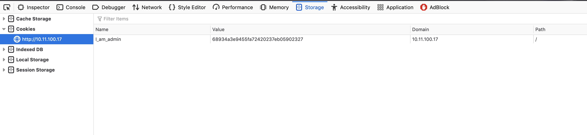
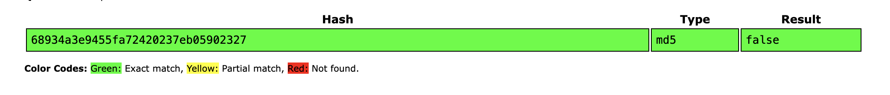
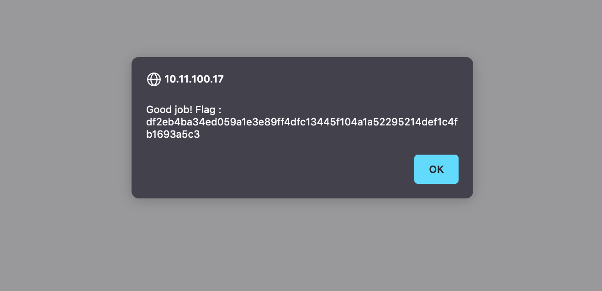

# Cookies.

Obviously we're not talking about the eatable cookies... Or are we ?

## What are cookies ?
It would be fun if they were eatable stuff but they're not. Cookies are a way to authenticate who are you while you are browsing a website.
Let's say you are a user in `Facebook`. And you are a member in a `group`. How does `Facebook` recognize you as a simple member in the `group` and not as an admin of that `group`. That's what `cookies` do.
They are encrypted message that contains infos about you and your role.
Note: Cookies are local.

You can always see what cookies you're using, by either using `web developer tool` or an extension on your browser. In our case we will use the `web developer` tool.

On the main page for example we can go and check the `web developer` tool, then go to `Storage`, then `Cookies`, then if the website uses some sort of cookies we'll find them there. Let's try to decrypt the value of the cookie.

So now we know that the meaning of the cookie is `false`. What happens if we change is to `true` ? Let's find out. First we encrypt the cookie phrase `true` and change the one we found on `web developer` and then reload the page.

Voila we have a flag.

## How to protect ?
The first option, is to encrypt it the hard way, a way that no one can crack it. Otherwise you can use libraries that already exists(like jwt if you are working with nodejs).
You can also use google authentication system.

