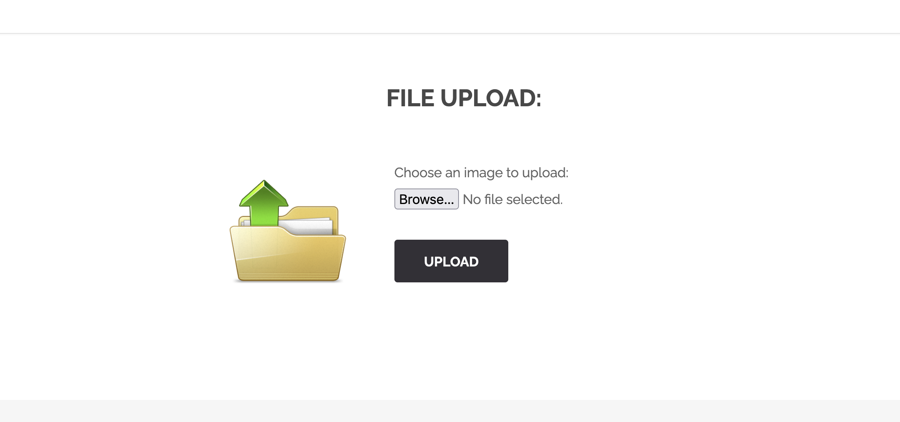
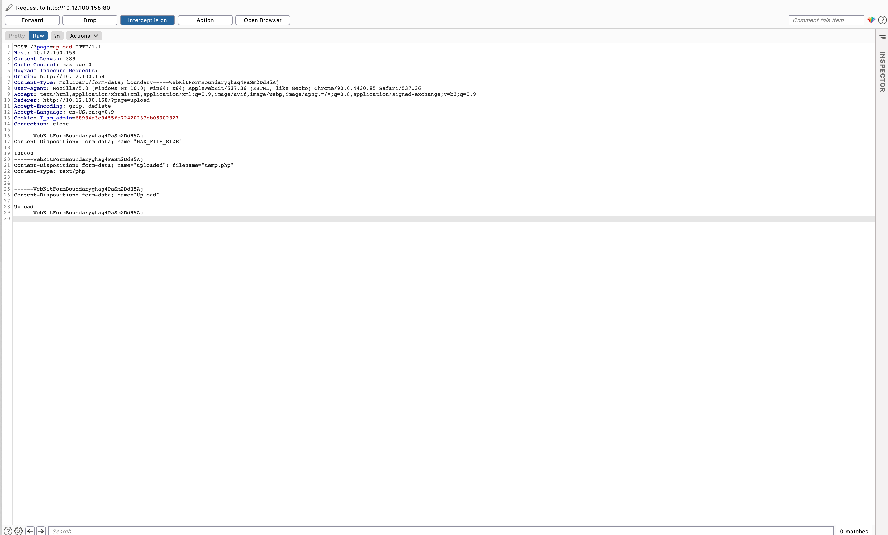
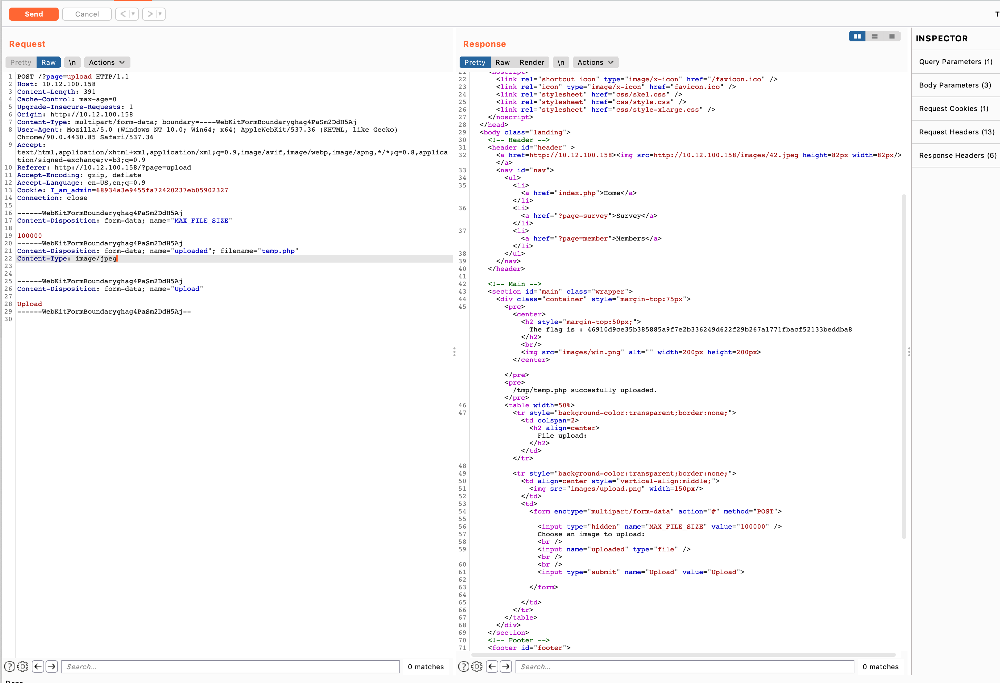

# File Upload

On the home website, you can scroll down to find a `upload image` link.




Uploading a random file gives us an error
```
Your image was not uploaded.
```


We interupt the request with `BurpSuite` :



We send it to the repeater, notice that the content type is a php file :
```
Content-Type: text/php
```

Let's change that to `image/jpeg` and send the request :




Voila we get the flag.

## How to protect ?
Make a script the checks the extention, and check content type. Maybe also restrict the upload only to admins.