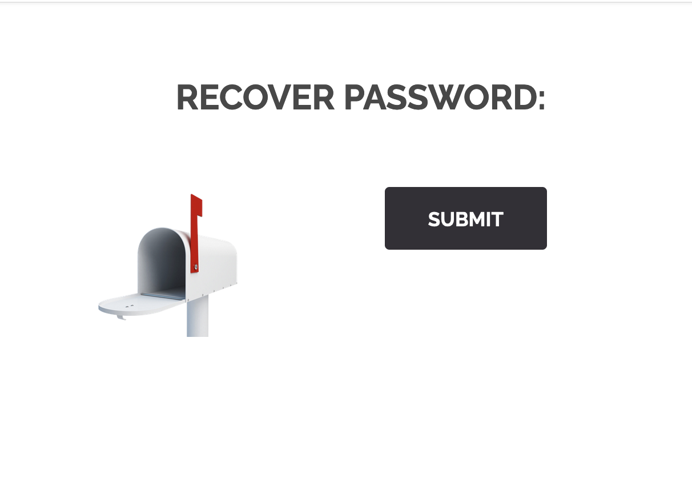
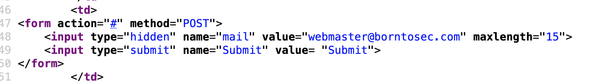
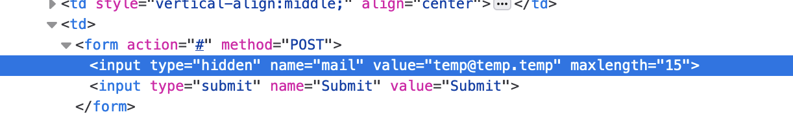
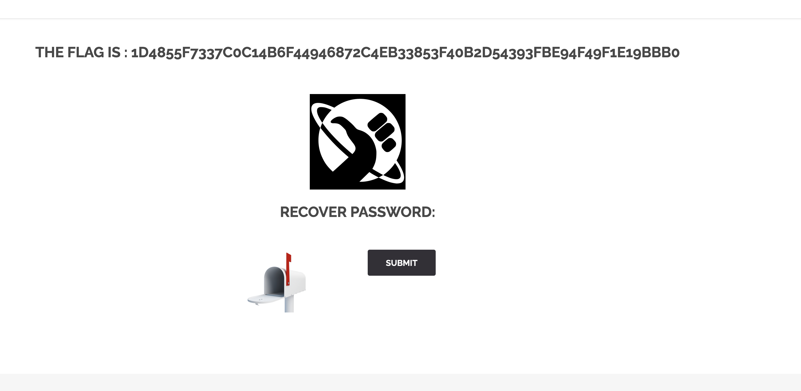

# Hidden Input

The `<input type="hidden">` defines a hidden input field. We can find it in lot of pages in the website. But the one we're talking about here is when you go to `sign in` and click `forget password`

It's weird to have a forget password and not have email input. So we viewed the source page. In the source you will find a `<input type="hidden" ...>`.

Let's go back to our page, and use `web developer tool` so we can change it.

Then we submit and we can get the flag.

## How to protect ?
Don't use hidden input or if you use it, add readonly attribute.
