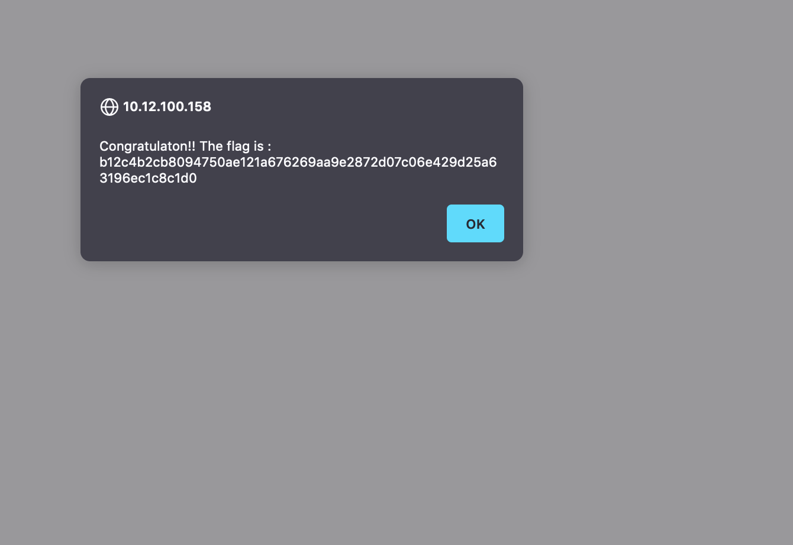

# Path Traversal

Path traversal is simply being able to navigate through paths in the web.

Going to survey, in the url we can find that there's a variable named `page`.
```
http://10.12.100.158/index.php?page=survey
```

Change that `page` variable to `../../../../../../../etc/passwd` and we can get the flag



## How to protect
Simple always remove the `../` whenever you find it. Manage permissions as well.