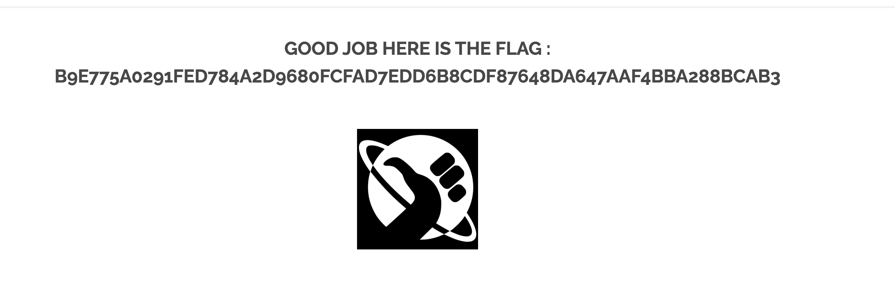

# Redirect

On the main page of our website, we scroll down to the very bottom.

We find 3 icons of social medias.


We don't click them, we chose one and we copy the link that redirects us.

Then we will have something like this :
```bash
"http://10.30.228.84/index.php?page=redirect&site=facebook"
```

We can change the `site` variable from `facebook` to let's say for example to `google`.

And just like that we have the flag by requesting the new url that looks like the following:
```bash
"http://10.30.228.84/index.php?page=redirect&site=google"
```



## How to protect ?
This can cause to a fake website redirection. So we must check what website we are requesting before we send the request. Then simply drop the request or reject it if the `site` variable doesn't match our certain `site` variables.