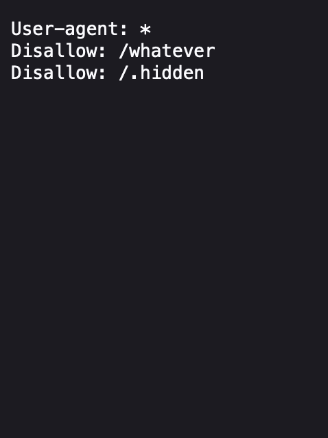
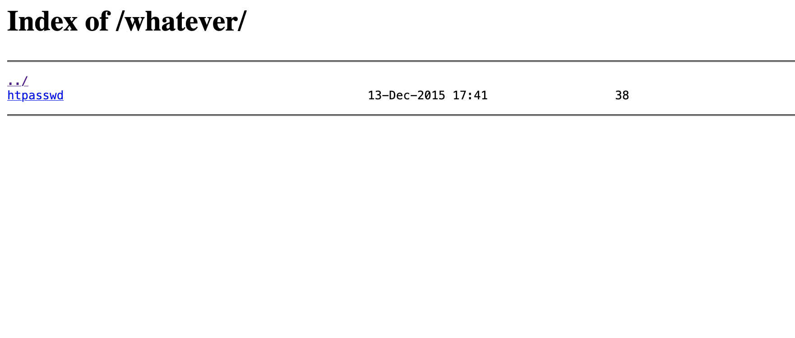
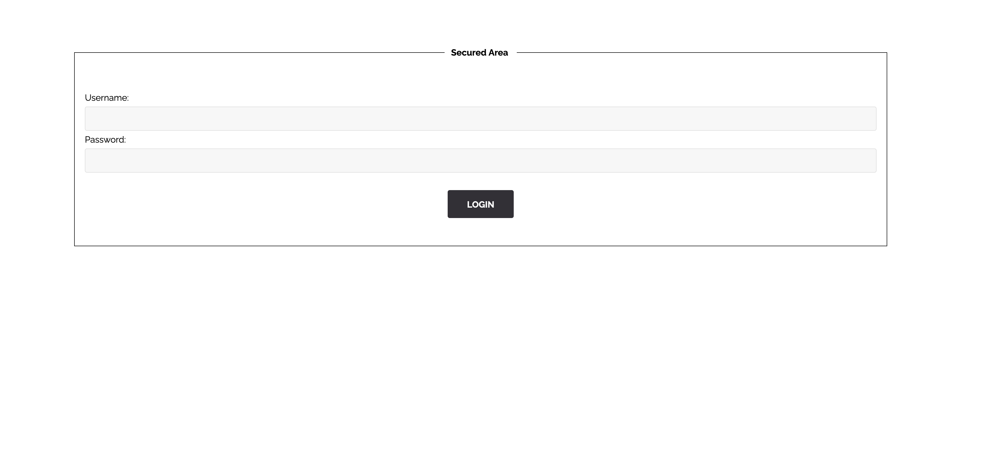

# ROBOTS.TXT

To talk about the term `robots.txt` we need first to talk about web crawlers. And to have a basic understand on how web engines work.

## Web Crawler
The job of a web crawler, spider web, or search engine bot, is to download and index content from all the World Wide Web. In other meaning, they automate the understanding of a web content.

## robots.txt
So this file makes spider's job easier. It got information to instruct those web crawlers on how to crawl their web pages.

## robots.txt on The Website.
Okey so visiting `robots.txt` on the website we found couple of directories.



Let's visit the `whatever` directory first.



Okey cating that htpasswd we get :
```
root:8621ffdbc5698829397d97767ac13db3
```

At first we thought it's `ssh` credentials. It didn't work. We thought about `/admin` or `/login.php`, and it worked with `/admin`.



It gave us wrong answer. So I went and decrypt that password, since it looked like a `md5` encryption.
We did decrypt it and it gave us the word `dragon`. Usign `root` with `dragon`, it gave us the flag.


## How to protect ?
Disallow *, and dont put anything important in robots.txt
