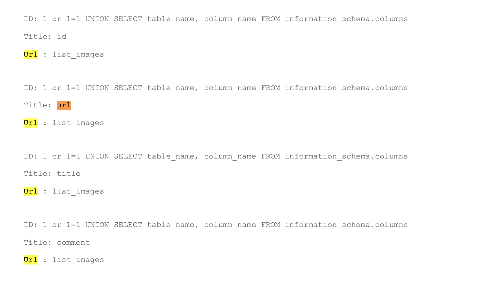
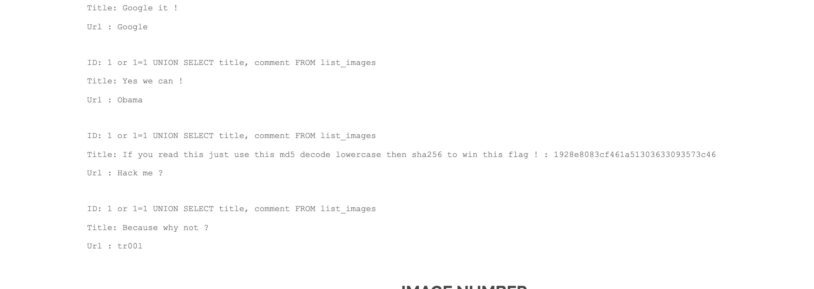

# SQL Injection 2

## Before:
You can check the following [writeup](https://github.com/mza7a/darkly/blob/master/SQL%20Injection%201/Resources/readme.md), since this `sql injection` is pretty similar with it.

A simple `UNION` statement will show us all tables, and then we need to look at something like `title=url` or `Url=url` to know the exact column name we're looking for.



So basically the table name is `list_images` and then the columns name.

Let's chose `title` and `comment`. Our payload will be something like this :
```sql
sql> 1 or 1=1 UNION SELECT title, comment FROM list_images;
```



Works like a charm. Then we can just decode it.

## How to protect ?
Same as the above sql injection 1.