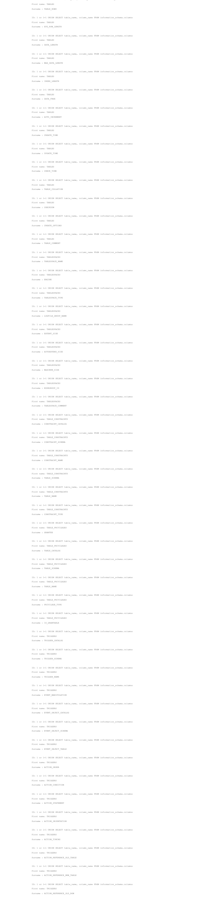

# SQL Injection

## What is SQL Injection :
SQL Injection is a web security vulnerability that allows the attacker to interfere with the queries that an application makes to its database. It can allow the attacker to view the database, and in some cases drop the whole database. Which leads to losing the whole data in your database. These data in some cases are not accessible to everyone. In some cases as well viewing sensitive data.
For more theoric perspective I invite you to visit this [link](https://owasp.org/www-community/attacks/SQL_Injection).

## How to find SQL Injection :
SQL Injection is mostly related to inputs, whenever you find an input, there's a possibility of a SQL Injection. You can submit any possible sql expression and if you get an error back it means that the input is vulnerable to sql injection.
There are many ways to find if your application is vulnerable to sql injections. I invite you again to visit this [repo](https://github.com/payloadbox/sql-injection-payload-list) in github, a really great repository for sql injections.

## SQL Injection in Our Case :
You can find a SQL Injection in `Search member by ID:`


A simple `'` input will give us the following error :


Note: Not everytime the sql injection is based on errors. There are many ways, you can check them [here](https://github.com/payloadbox/sql-injection-payload-list).

Now let's try and see if we can find all the data in the members table.

### SQL Injection base on 1=1 is Always True :

Let's take this as an example :
```sql
sql> SELECT * FROM Users WHERE UserId = $_GET(id);
```

What the above code does is simple. It makes a request to get a user by its id. Similar case to ours here.
And as you can see there's nothing that prevent from entering something wrong, or a bad input in general. A simple input like the following will result in a sql injection.
```sql
1 or 1=1
```

Meaning that the request will become (to learn more check this [link](https://www.w3schools.com/sql/sql_injection.asp)):
```sql
//The request then will be :
SELECT * FROM Users WHERE UserId = 1 or 1=1;
//Meaning since the 1=1 is a true expression anything that is in that table will be shown.
```

This will result in the following :


Okey, very good we know that we have a SQL Injection. What's next ? 

We can use `UNION` statement, since we have a `SELECT` statement. We can just synchronize 2 outputs of `SELECT` statement and have ours.

We can also use something called `INFORMATION_SCHEMA.COLUMNS`, it allows us to get information about all columns for all tables and views within the database.
```sql
sql> SELECT users FROM information_schema.columns;
```

Running this command with the following input will result in :
```sql
input> 1 or 1=1 UNION SELECT * FROM information_schema.columns
```


You have to know that `UNION` only works when the number of columns are the same. So we must have exactly 2 args to match them with `First name` and `Surname`.
Since we need the name of tables and its columns. We can work it out like the following :
```sql
sql> SELECT table_name, column_name FROM information_schema.columns;
```
This will print in the `First Name` the table_name, and then in the `Surname` the column_name

Meaning our payload will be something like the following :
```sql
input> 1 or 1=1 UNION SELECT table_name, column_name FROM information_schema.columns;
```



This is wokring, but we have lot and lot of tables. Let's look for a column_name that's equals to `full_name`(since we have full names in the initials).
We found nothing. Let's try something like `first_name`.

We do find a column in a certain table named `first_name`. It's under the `users` table.


Okey now our next injection will be like the following :
```sql
sql> 1 or 1=1 UNION SELECT Commentaire, countersign FROM users;
```


And we have the flag if we decrypt that password.

## How to protect ?
Simply sanitize the input. Don't send the input directly to sql command. Check if there's any special characters.