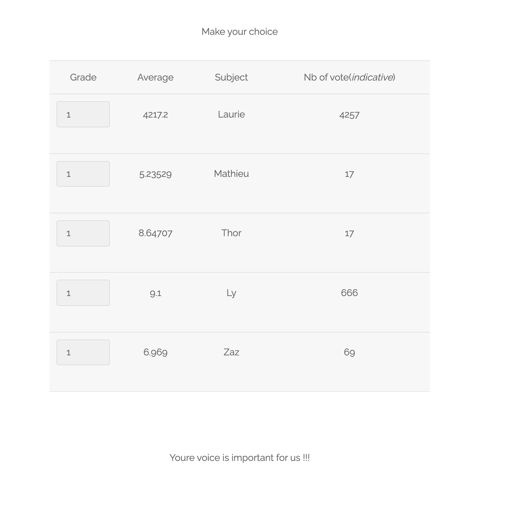
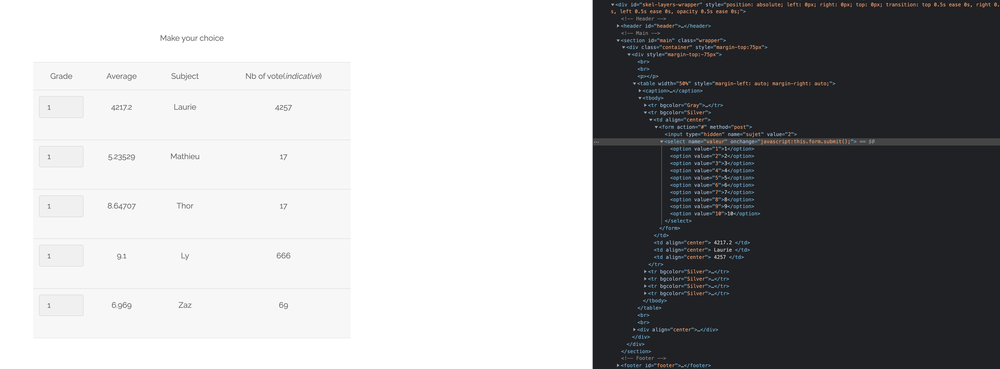
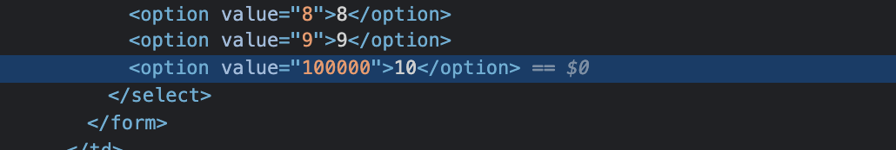
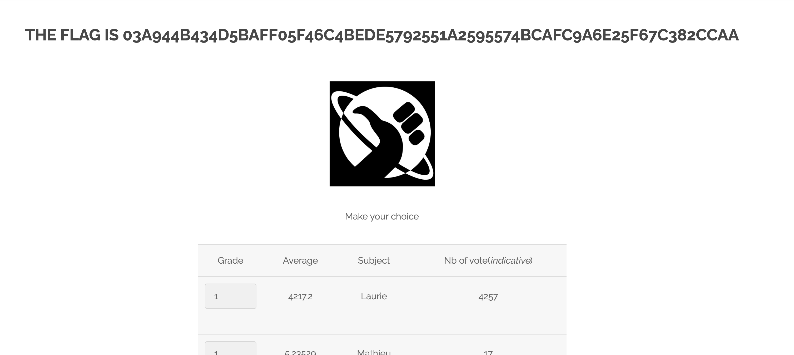

# Survey Exploit

On the home page of our website and on the right, we find a tab named `survey`. We click on it

Let's inspect the `Grade` for `Laurie`.

Now we can change the value of for example `10` to something like this `100000`...

We can then chose it back in the website, and we have the flag.

## How to protect ?
Here we can just do a comparaison to whatever the user has entered in the value, for this example `1 <= x <= 10`. So even if a hecker changes the value, it will not be sumbited due the unequal sentence.