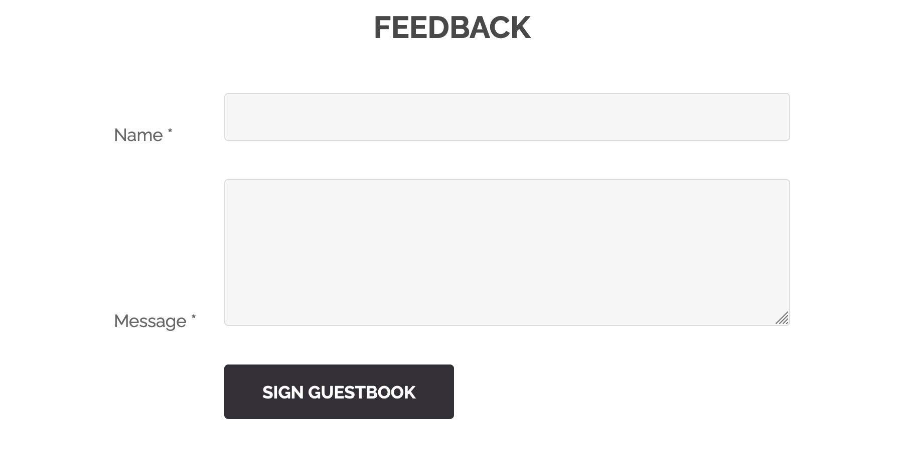
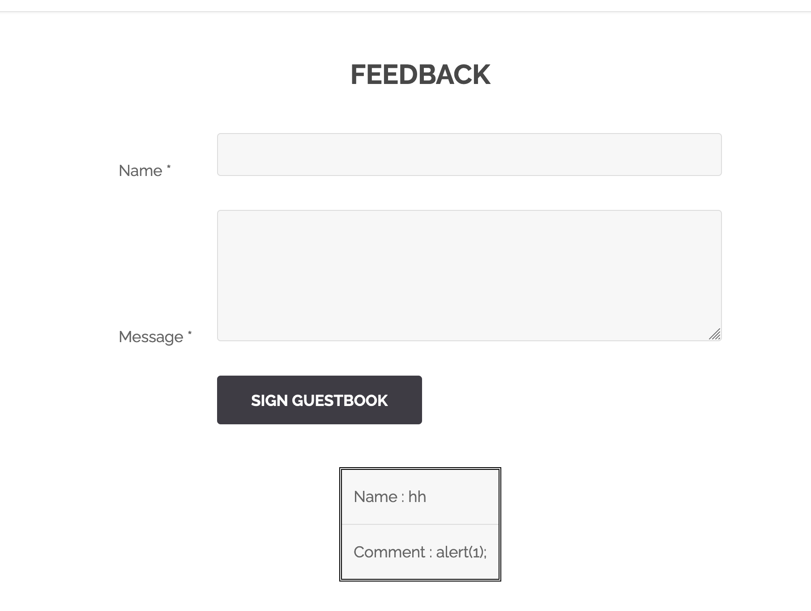

# XSS Feedback

## What's an XSS ?
Cross Site Scripting, is a way to include javascript scripts in inputs. It's often tested with `<script>alert(1);</script>

## PoC
Scrolling down on the website, we'll see that there's a tab named `Feedback`


Clicking on it will give us to fields as inputs, name and the feedback.



Entering some random stuff at first, nothing happens.
Then I tried a random `alert(1)` :
```
name = hh
feedback = <script>alert(1);</script>
```



Nothing happend. I tried puting it in the name, but I couldn't since the max size was less than the whole `<script>alert(1);</script>`.
I changed the max length in inspect. Still nothing happened.

After trying some payloads, we found that this one `<SCRIPT>alert(1);</SCRIPT>`... But no flag was shown.
We tried puting just `<script>`, it didn't work... Trying `<script` gives us the flag... Like wtf ??

## How to prevent ?
Sanitize the input, don't execute anything you get. You can also filter.